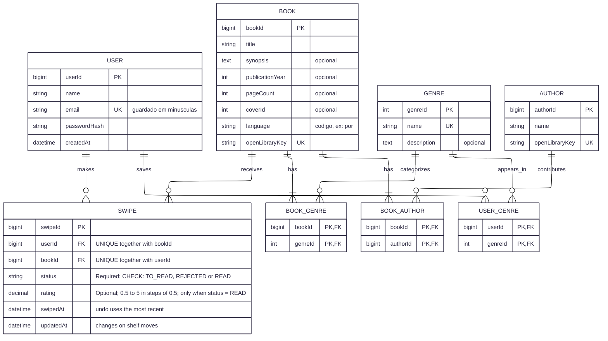

# Diagrama ER

```mermaid
---
config:
  theme: redux
  layout: elk
---
erDiagram
    USER ||--o{ SWIPE : makes
    BOOK ||--o{ SWIPE : receives
    BOOK ||--|{ BOOK_GENRE : has
    GENRE ||--o{ BOOK_GENRE : categorizes
    BOOK ||--|{ BOOK_AUTHOR : has
    AUTHOR ||--o{ BOOK_AUTHOR : contributes
    USER ||--o{ USER_GENRE : saves
    GENRE ||--o{ USER_GENRE : appears_in

    USER {
        bigint userId PK
        string name
        string email UK "guardado em minusculas"
        string passwordHash
        datetime createdAt
    }
    GENRE {
        int genreId PK
        string name UK
        text description "opcional"
    }
    BOOK {
        bigint bookId PK
        string title
        text synopsis "opcional"
        int publicationYear "opcional"
        int pageCount "opcional"
        int coverId "opcional"
        string language "codigo, ex: por"
        string openLibraryKey UK
    }
    BOOK_GENRE {
        bigint bookId PK, FK
        int genreId PK, FK
    }
    AUTHOR {
        bigint authorId PK
        string name
        string openLibraryKey UK
    }
    BOOK_AUTHOR {
        bigint bookId PK, FK
        bigint authorId PK, FK
    }
    SWIPE {
        bigint swipeId PK
        bigint userId FK "UNIQUE together with bookId"
        bigint bookId FK "UNIQUE together with userId"
        string status "Required; CHECK: TO_READ, REJECTED or READ"
        decimal rating "Optional; 0.5 to 5 in steps of 0.5; only when status = READ"
        datetime swipedAt "undo uses the most recent"
        datetime updatedAt "changes on shelf moves"
    }
    USER_GENRE {
        bigint userId PK, FK
        int genreId PK, FK
    }
```
